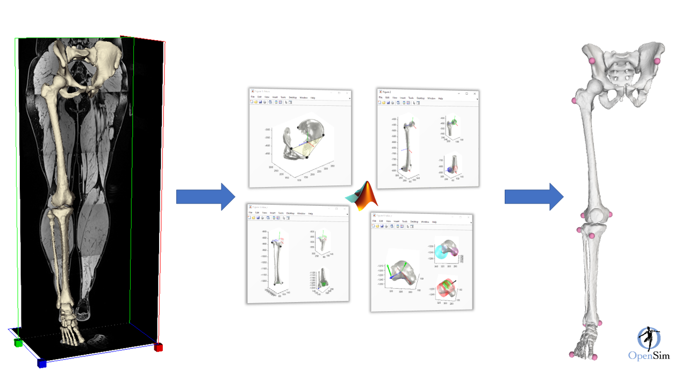
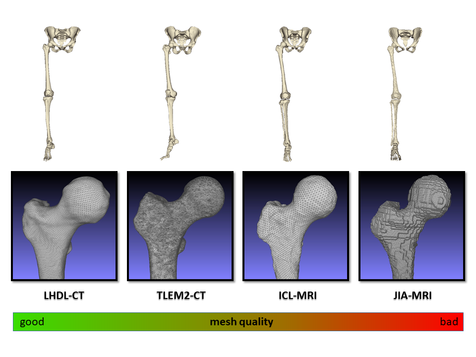

[](https://zenodo.org/badge/latestdoi/269616182) [](https://opensource.org/licenses/Apache-2.0)

# Table of Contents  <!-- omit in toc -->

- [Overview](#overview)
- [Brief summary of the publication](#brief-summary-of-the-publication)
- [Requirements](#requirements)
- [Resources included in this repository](#resources-included-in-this-repository)
- [Visualizing the OpenSim models](#visualizing-the-opensim-models)
  - [Manual models](#manual-models)
  - [Automatic models](#automatic-models)
- [Available MATLAB scripts](#available-matlab-scripts)
- [Current limitations to reproducibility](#current-limitations-to-reproducibility)

# Overview

This repository contains the data, models and the MATLAB scripts to inspect and reproduce the results of the following publication:

```bibtex
@article{Modenese2020auto,
  title={Automatic Generation of Personalized Skeletal Models of the Lower Limb from Three-Dimensional Bone Geometries},
  author={Modenese, Luca and Renault, Jean-Baptiste},
  journal={Journal of Biomechanics},
  year={2020, accepted},
  publisher={Elsevier}
  doi={https://doi.org/10.1016/j.jbiomech.2020.110186}
}
```
The paper will be open access [from the publisher's website](https://doi.org/10.1016/j.jbiomech.2020.110186) but it is also available [as preprint](https://www.biorxiv.org/content/biorxiv/early/2020/06/23/2020.06.23.162727.full.pdf).

# Brief summary of the publication
In our manuscript: 
* We presented a MATLAB toolbox called **STAPLE** for creating lower extremity models of the lower limb from three-dimensional bone geometries in a fully automatic way. STAPLE is openly developed [at this link](https://github.com/modenaxe/msk-STAPLE).
* We described the algorithms for automatic processing of the lower limb bone geometries that are included in the STAPLE package.
* We evaluated a workflow equivalent to the codified approach of [Modenese et al. (2018)](https://doi.org/10.1016/j.jbiomech.2018.03.039) by comparing lower limb models created following that methodology with the equivalente automatic workflow implemented in STAPLE. 
* Finally, we presented some additional functionalities of STAPLE, including the extraction of articular surfaces and the possibility of streamlining the creation of skeletal models with the automatic technique for generating muscle anatomical models published by [Modenese and Kohout, 2020](http://link.springer.com/article/10.1007/s10439-020-02490-4).



# Requirements
In order to use the content of this repository you will need to:
1. have MATLAB R2018b or more recent installed in your machine. The analyses of the paper were performed using version R2019b.
2. download [OpenSim 4.1](https://simtk.org/projects/opensim). You will use OpenSim to visualize the models. 
3. set up the OpenSim 4.1 API for MATLAB. Required to run the provided scripts. Please refer to the OpenSim [documentation](https://simtk-confluence.stanford.edu/display/OpenSim/Scripting+with+Matlab).
4. install the [SPM1D](http://spm1d.org/) MATLAB package for statistical parametric mapping (SPM). It is used to run the statistical analysis when comparing the gait simulations from automatic and manual models.
5. (optional) [OpenSim 3.3](https://simtk.org/projects/opensim). This can be used for visualising the manual models. To install OpenSim 3.3 go to the `Download` page of the provided link and click on `Previous releases`, as shown in [this screenshot](https://github.com/modenaxe/3d-muscles/blob/master/images/get_osim3.3.PNG). No API installation required for OpenSim 3.3.
6. clone this repository together with the STAPLE submodule using the following command on git:
```bash
git clone --recursive https://github.com/modenaxe/auto-lowerlimb-models-paper.git
```
or if you have cloned it without the recursive option please refer to [this post](https://stackoverflow.com/questions/25200231/cloning-a-git-repo-with-all-submodules) and use:
```bash
git submodule init
git submodule update
```


# Resources included in this repository
This repository includes:
1. various [datasets of three-dimensional bone geometries](./bone_geometries) obtained from computed tomography and magnetic resonance imaging scans (medical images not provided). Some open access publications in which these models had been employed in previous research are [shared with this repository](/abstracts_&_papers).
2. STAPLE package as git submodule (please refer to [this link](https://gist.github.com/modenaxe/c64974a53c72fb6cdebd380933b45d38) for the use of submodules...it's easy!
3. OpenSim `manual models` created from the anatomical dataset using the codified approach of [Modenese et al. (2018)](https://doi.org/10.1016/j.jbiomech.2018.03.039).
4. OpenSim `automatic models` generated using STAPLE with the data from the provided anatomical datasets as inputs.
5. Gait data provided with the JIA-MRI model by [Montefiori et al. (2019)](https://link.springer.com/article/10.1007%2Fs10439-019-02287-0) and downloadable from [this link](https://figshare.shef.ac.uk/articles/dataset/Data_for_paper_Linking_joint_impairment_and_gait_biomechanics_in_patients_with_Juvenile_Idiopathic_Arthritis_/6237146)
6. Gait simulations generated from those data using both the manual and automatic model to compare the obtained joint kinematics and kinetics, stored [in this folder](/gait_simulations).
5. MATLAB scripts to recreate the models, tables and figures of the paper.



# Visualizing the OpenSim models

## Manual models
The [manual models](/opensim_models) can be visualised with OpenSim 3.3. 
The bone geometries are binary vtp files and are NOT visible in OpenSim 4.0
The muscles and virtual markers have been removed from the original models.
These models were generated using NMSBuilder v1.0. The NMSBuilder files are not shared because of their size (they include medical images).
The complete OpenSim models and the NMSBuilder models can be obtained contacting the corresponding author of the publication.

## Automatic models
The [automatic models](opensim_models) can be visualised with OpenSim 4.1. 
The bone geometries are ASCII files in OBJ format. If they are not present in the repository, they will be generated by a_createOsimModels.m during 
the creation of the models from the matlab triangulations included in the ./bone_geometries folder.

# Available MATLAB scripts
The provided MATLAB scripts produce the results described in the following table:

| Script name | Script action | Related item in the manuscript|
| --- | --- | --- |
| createAutomaticOsimModels.m | creates the automatic OpenSim model using the bone geometries from the `bone_geometries` folder | N/A |
| compare_osim_models.m | compares the joint coordinate systems of the automatically generated and the manual OpenSim models | Table 4 |
| plot_biomech_curves.m | plots the joint angles and net joint moments computed in the gait simulations | Figures 4-5 |
| compute_gait_metrics_SPM_ttests.m | computes the correlation coefficients, root mean squared errors and runs a paired, two-tailed SPM t-test | Results and Tables S2-S3|
| compare_hip_fit.m | compares, in all datasets, the estimations of the centres of the femoral head provided by Kai-femur and GIBOC-tibia | Table 4 | 
| compare_pelvis_algorithms.m | compares, in all datasets, the joint coordinate systems estimated by `STAPLE-pelvis` and `Kai-pelvis` algorithms using the former as reference | Table 5 |
| compare_knee_algorithms.m | compares, in all datasets, the joint coordinate systems estimated by all `GIBOC-`, `Kai-` and `Miranda-` algorithms at the distal femur and proximal tibia, i.e. at tibiofemoral joint. `GIBOC-Cylinder` is used as reference | Table 5 |
| suppl_mat_tibiofemoral_alignment.m | compares, in all datasets, the joint coordinate systems estimated by all `GIBOC-tibia`, `Kai-tibia` and `Miranda-tibia` algorithms against the `GIBOC-Cylinder` algorithm for the femur to quantify the tibiofemoral alignment. | Table S1 (Supplementary Material) |
| suppl_mat_compare_PCA_vs_Inertial.m | compares, in all datasets, the vertical anatomical axis of the tibia when computed using principal component analysis as in `Kai-tibia` or principal inertial axes as in all `GIBOC` algorithms for the tibia | Table S2, Figure S3 (Supplementary Material) |

Other MATLAB scripts are provided in the `support_functions` and `support_functions_plot` folders, but the user is not supposed to interact with them.

# Current limitations to reproducibility
* The `Miranda-femur` and `Miranda-tibia` algorithms are not available with this package but they can be obtained contacting directly the authors of [the related publication](https://doi.org/10.1016/j.jbiomech.2010.01.036).
* The manual OpenSim models were generated using NMSBuilder v1.0. The NMSBuilder files are not shared because of their size (they include medical images). The complete NMSBuilder models can be obtained contacting the corresponding author of the publication.
* The STAPLE pack is in strong development, but in this repository we froze the version used for the manuscript through the Git submodule. The latest **development** version of STAPLE will always be available [at this repository](https://github.com/modenaxe/msk-STAPLE), while the latest **stable** version will be shared through its [SimTK project page](https://simtk.org/projects/msk-staple).
